### Netflix Clone with React Native

### Used:

- **Axios** to do API calls
- **API**: https://api.themoviedb.org/3
- **RN-Dotenv** to hide the api key
- **react-native-youtube-iframe** to show trailers of the movies

### Screenshots:

<table>
  <tr>
    <td>Home Screen Movie Banner</td>
     <td>Movie Categories</td>
     <td>Movie Categories - 2</td>
  </tr>
  
  <tr>
    <td>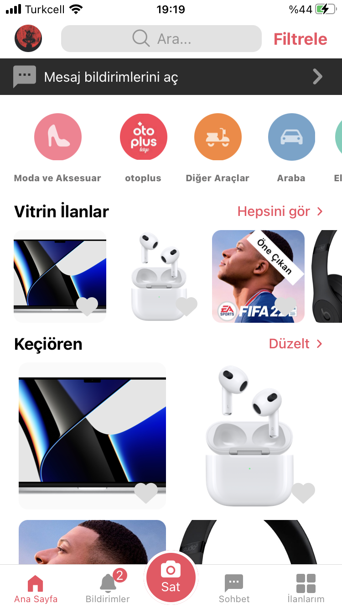</td>
    <td>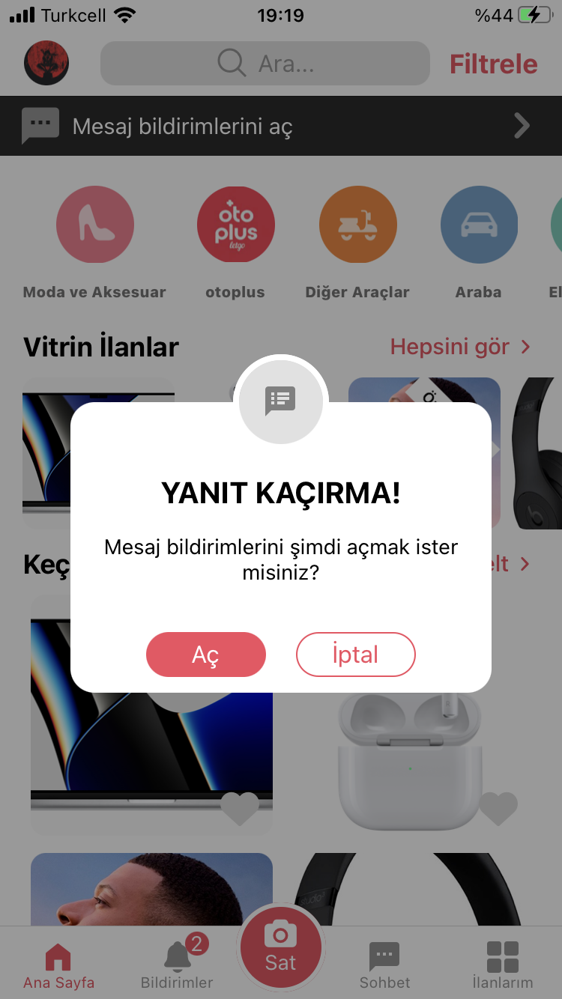</td>
    <td>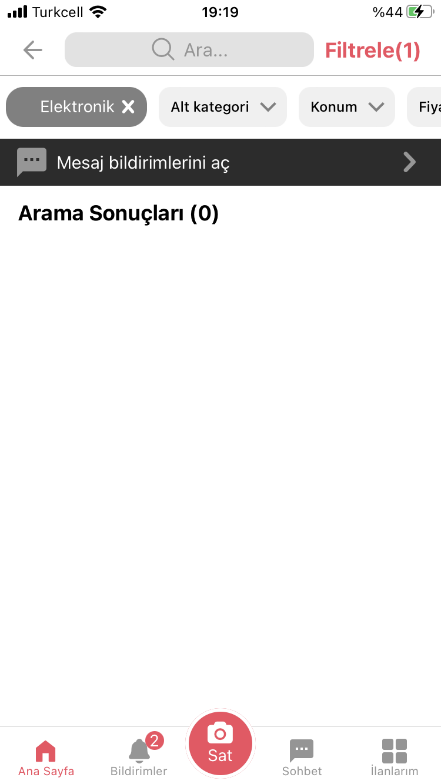</td>
  </tr>
 </table>

<table>
  <tr>
    <td>Movie Detail Modal</td>
     <td>Movie Detail Modal - Similar Movies</td>
     <td>Movie Detail Modal - Movie Trailer on Youtube</td>
  </tr>
  
  <tr>
    <td>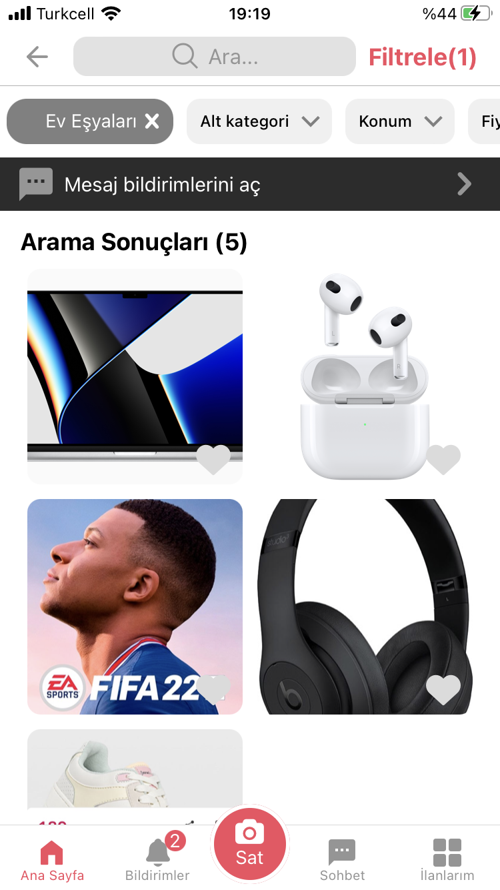</td>
    <td>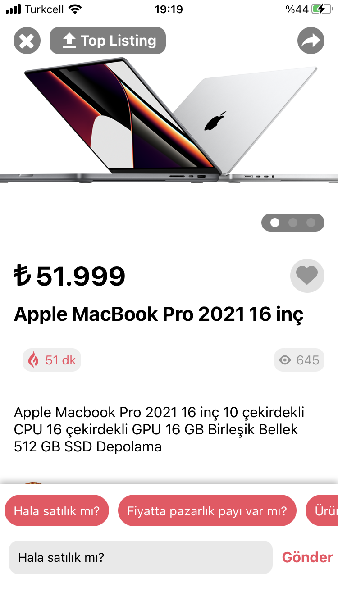</td>
    <td>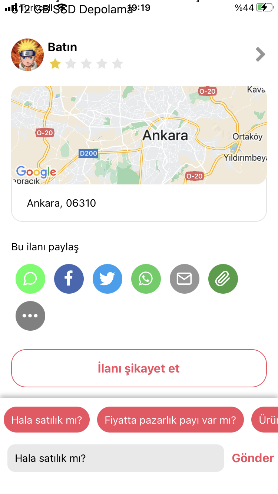</td>
  </tr>
 </table>
 
 <table>
  <tr>
    <td>New and Popular Screen</td>
     <td>New and Popular Screen 2</td>
     <td>Search Screen without a Search Term</td>
  </tr>
  
  <tr>
    <td>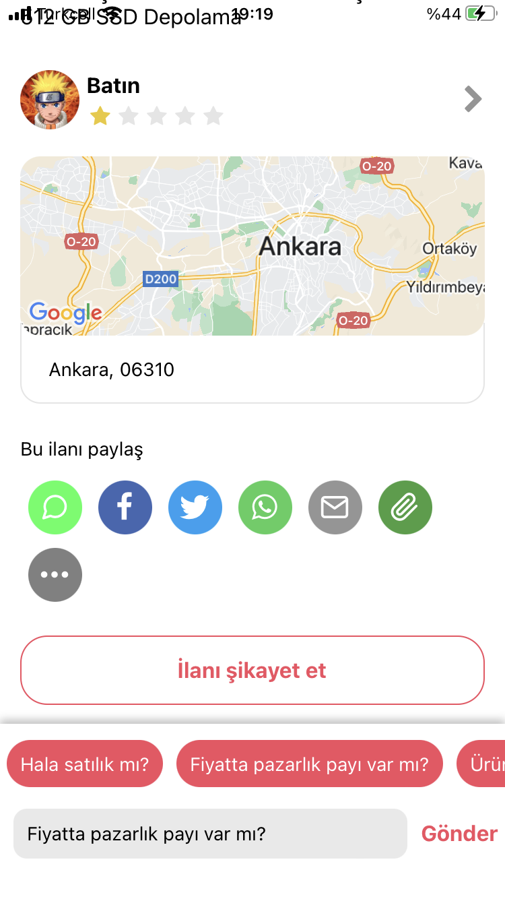</td>
    <td>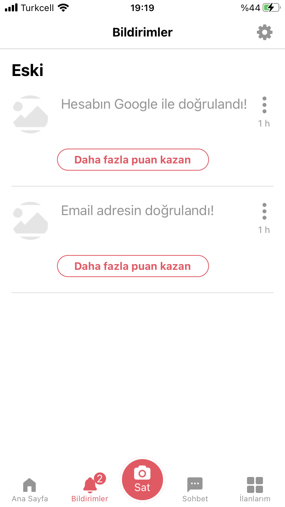</td>
    <td>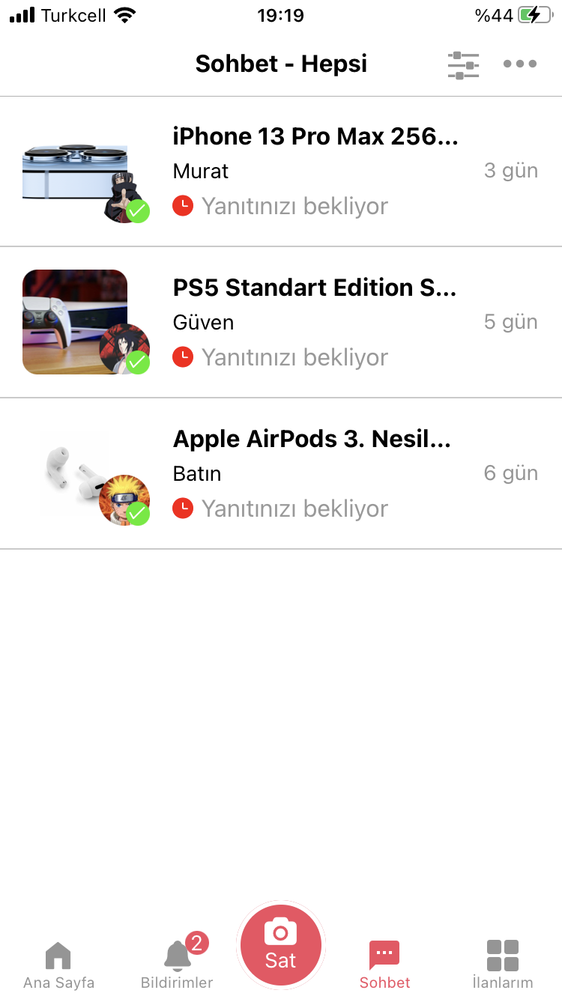</td>
  </tr>
 </table>

 <table>
  <tr>
    <td>Search Screen With a Search Term</td>
     <td>Downloads Screen</td>
  </tr>
  
  <tr>
    <td>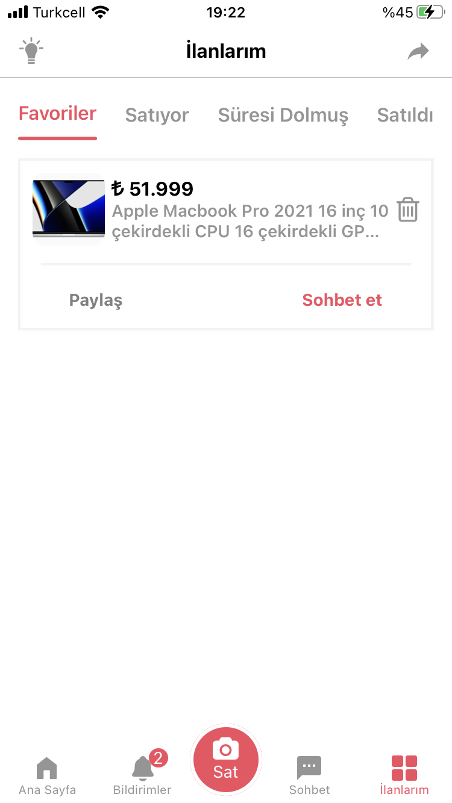</td>
    <td>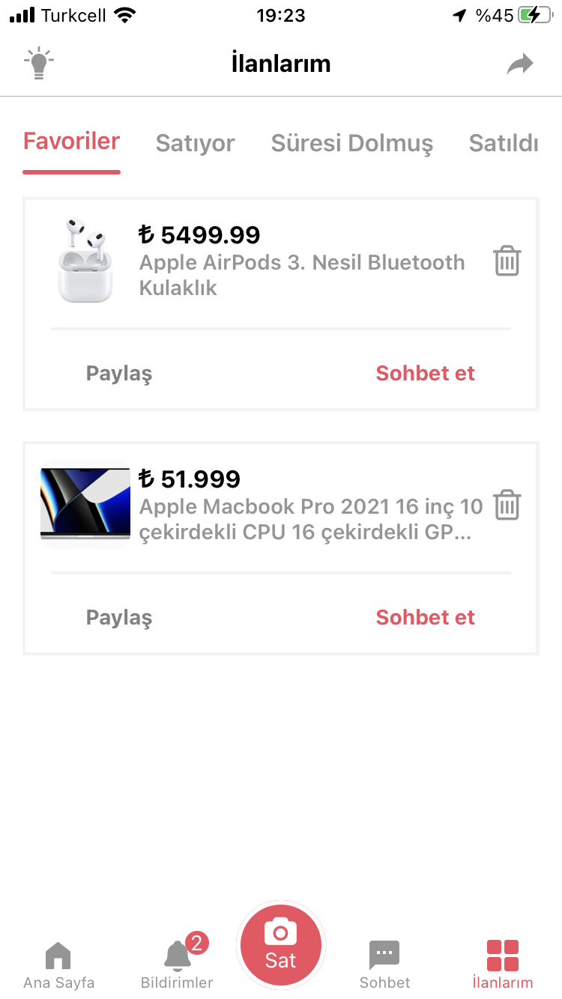</td>
  </tr>
 </table>
