### Letgo Clone with React Native, TypeScript and AWS Amplify

### Letgo is an e-commerce app that users can sell their used or brand new products

### Real-time subscriptions for users when they post products, add new favourite product to their baskets

### and deleting posts or favourite products

### Users can filter the products by Categories

### Images of the products are stored in S3

### Used:

- **Stack:**

  - **TypeScript**
  - **React-Native-Async-Storage**
  - **React Navigation**
  - **AWS Amplify**
    - **AWS DataStore**
    - **AWS S3**
    - **AWS GraphQL API**

- **Packages:**
  - **expo-image-picker**
  - **react-native-maps**
  - **react-native-expo-fancy-alerts**
  - **react-native-get-random-values**
  - **uuid**

### GIF:

-**GIF is laggy because of the size of the gif, its 5 fps.**

<table>
  <tr>
    <td>App Showcase GIF</td>
  </tr>
  
  <tr>
    <td></td>
  </tr>
 </table>

### Screenshots:

<table>
  <tr>
    <td>Home Screen</td>
     <td>Message Notification</td>
     <td>Filter by Category</td>
  </tr>
  
  <tr>
    <td></td>
    <td></td>
    <td></td>
  </tr>
 </table>

<table>
  <tr>
    <td>Filter by Category with Products belong to that Category</td>
     <td>Product Detail Screen</td>
     <td>Product Detail Screen - 2</td>
  </tr>
  
  <tr>
    <td></td>
    <td></td>
    <td></td>
  </tr>
 </table>
 
 <table>
  <tr>
    <td>Product Detail Screen - 3(Changing message dynamically)</td>
     <td>Notification Screen</td>
     <td>Messages Screen</td>
  </tr>
  
  <tr>
    <td></td>
    <td></td>
    <td></td>
  </tr>
 </table>

 <table>
  <tr>
    <td>Favourite Products Screen</td>
     <td>Favourite Products Screen - 2(Adding new Favourite Product)</td>
     <td>Favourite Products Screen - 3(Deleting Product)</td>
  </tr>
  
  <tr>
    <td></td>
    <td></td>
    <td></td>
  </tr>
 </table>

 <table>
  <tr>
    <td>My Listings Screen</td>
     <td>Deleting Post from Listings(Deletes from database)</td>
     <td>Sell Product Screen(Selecting Category)</td>
  </tr>
  
  <tr>
    <td>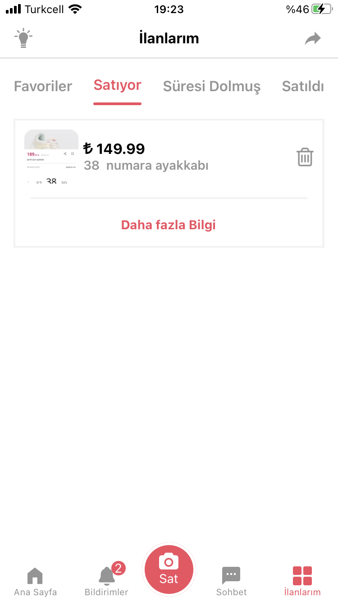</td>
    <td>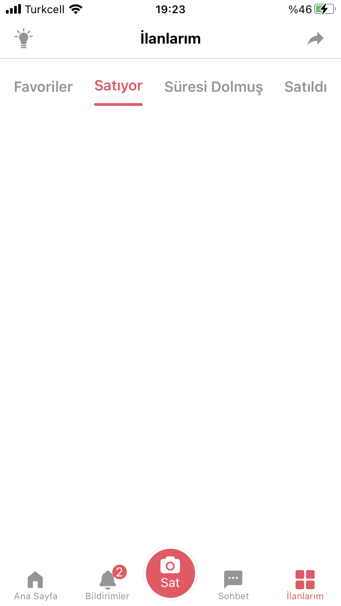</td>
    <td>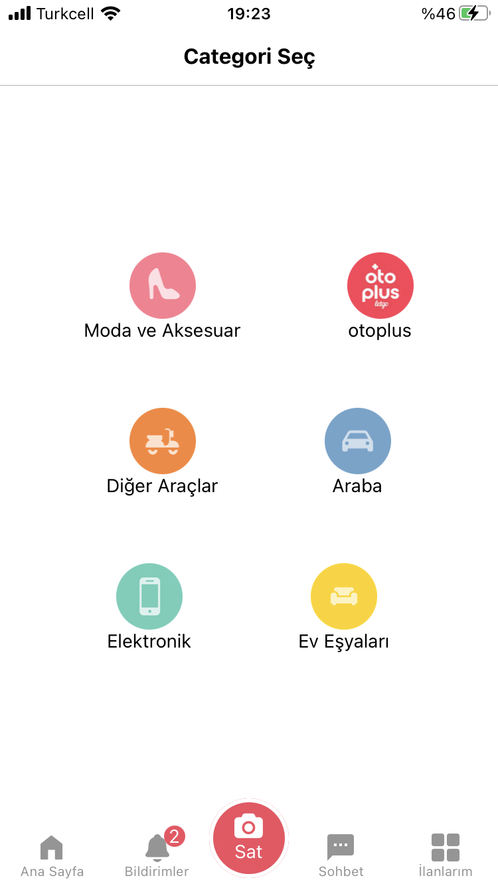</td>
  </tr>
 </table>

 <table>
  <tr>
    <td>Listing Post Detail Screen</td>
     <td>Listing Post Detail Screen - 2</td>
     <td>Listing Post Detail Screen - 3</td>
  </tr>
  
  <tr>
    <td>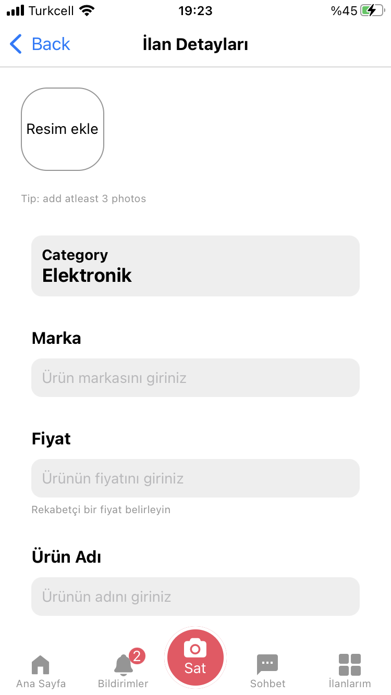</td>
    <td>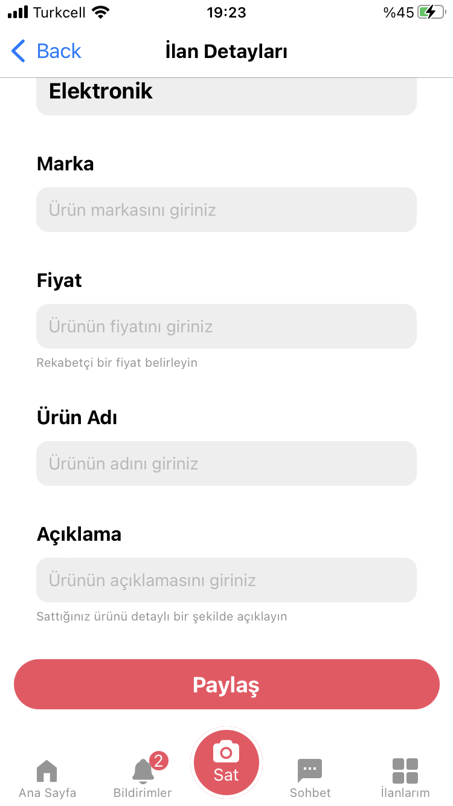</td>
    <td>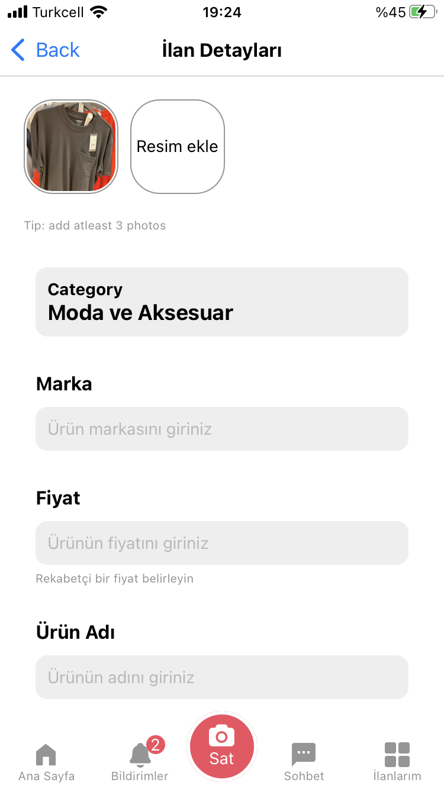</td>
  </tr>
 </table>

 <table>
  <tr>
    <td>Listing Post Detail Screen - 4</td>
     <td>Listing Post Detail Screen - 5</td>
     <td>Posting</td>
  </tr>
  
  <tr>
    <td>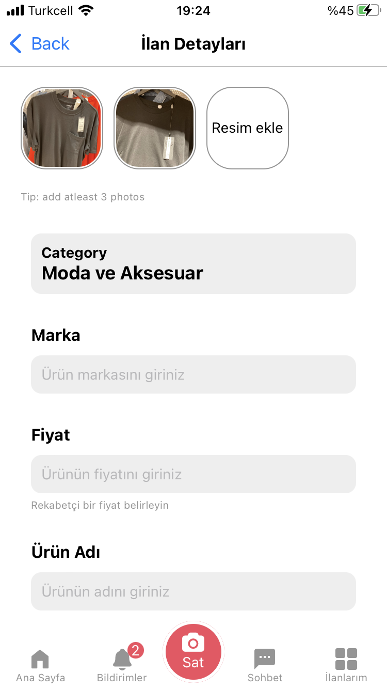</td>
    <td>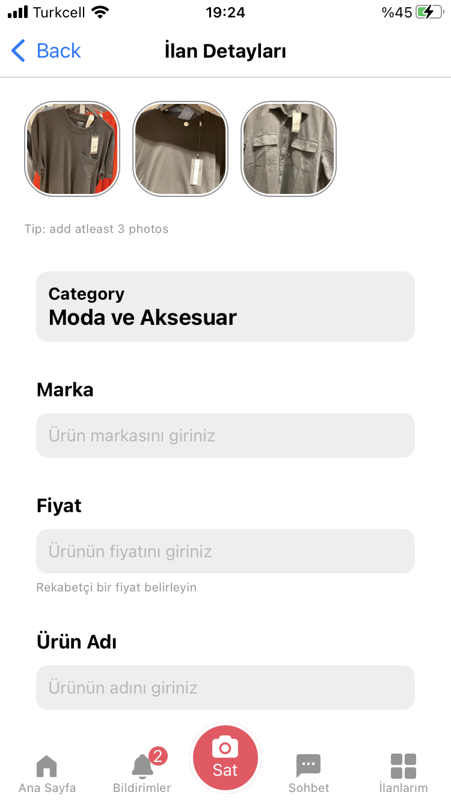</td>
    <td>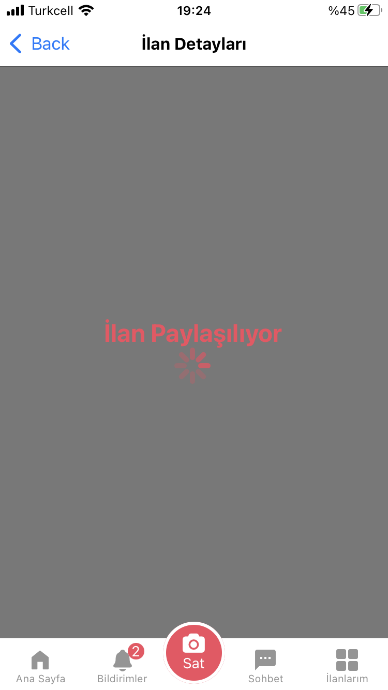</td>
  </tr>
 </table>

 <table>
  <tr>
    <td>Posting Alert</td>
     <td>Posts updates</td>
     <td>My Listings updates when user Posts</td>
  </tr>
  
  <tr>
    <td>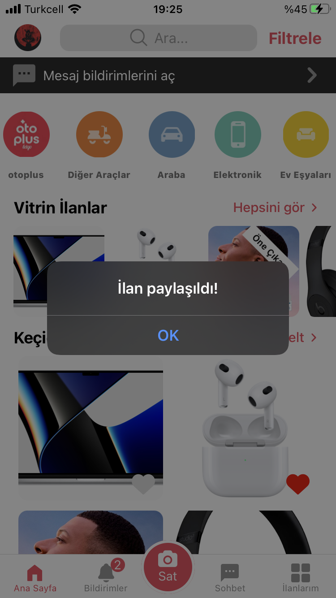</td>
    <td>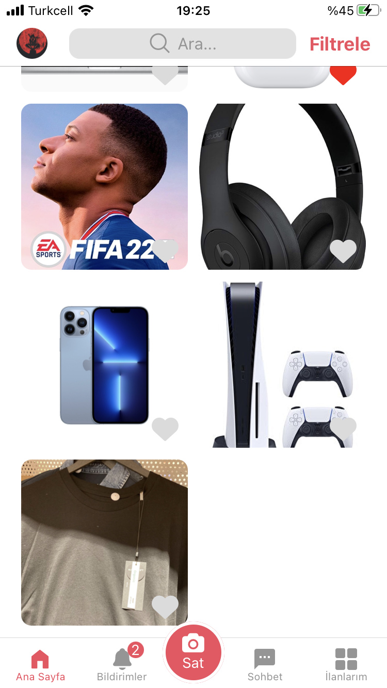</td>
    <td>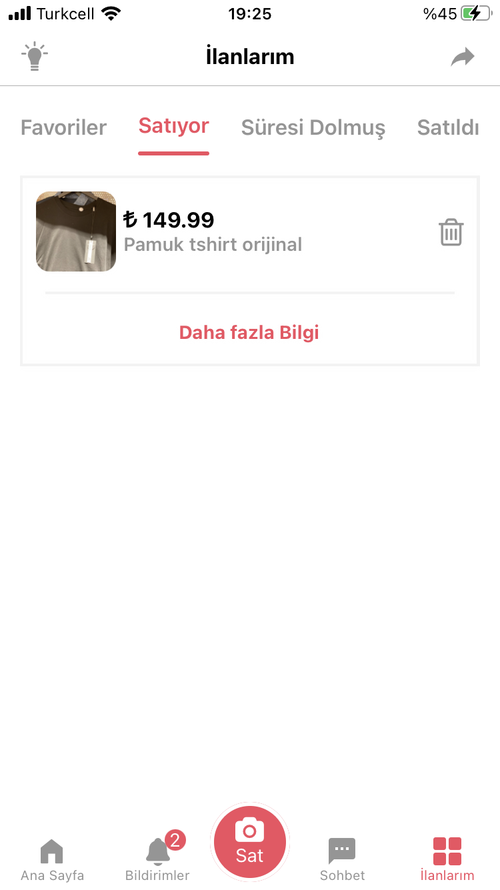</td>
  </tr>
 </table>
